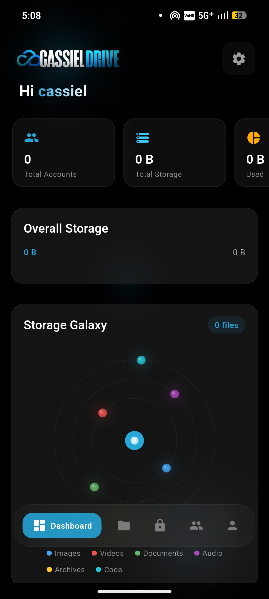



  
   
  <h1>CASSIELDRIVE v2.0</h1>
  
<b>Unlimited Cloud. Zero Limits.</b>

  
A beautifully crafted client that transforms your Google Drive into a premium, fluid, and limitless storage experience.

  
  
  
  

 

  

---

<h2 align="center">✨ 🌌 The Storage Galaxy</h2>

  CassielDrive isn't just a file manager; it's a visual experience. Your files orbit in our signature <b>Storage Galaxy</b>, categorized by dynamic planetary colors. Built with a pure OLED dark UI, glassmorphism layers, and silky 60-120 FPS transitions.

## 🚀 Core Features

*   <b>♾️ Unlimited Organization:</b> Seamlessly maps multiple Google Drive accounts into a unified, hyper-fast local interface.
*   <b>🔒 Cassiel Vault:</b> Military-grade AES-256 local encryption for your most sensitive documents. Keep your private files locked away.
*   <b>🎨 Dynamic OLED Themes:</b> Optimized for pure black OLED displays with ambient blurred background particles. Seamlessly toggle between our exclusive high-contrast palettes.
*   <b>⚡ Buttery Smooth UI:</b> iOS-like page routing, slick gestures, and a docked glassmorphism top navigation strip tailor-made for Desktop & Web.
*   <b>📱 Universal Support:</b> Flawlessly responsive across Android and Desktop/Web platforms.

## 🛠️ Setup & Installation

CassielDrive runs safely on your personal Google Drive OAuth credentials, ensuring you completely own your API quota and privacy.

### 1. Generate OAuth Client ID
1. Go to the [Google Cloud Console](https://console.cloud.google.com/).
2. Create a new project and enable the **Google Drive API**.
3. Configure the OAuth Consent Screen (<b>crucial:</b> add your personal email as a **Test user**).
4. Create **OAuth Client ID Credentials** and select **Desktop app** as the application type *(this is required to handle native loopback ports on Android securely)*.

### 2. Enter Credentials
1. Launch CassielDrive via the [Web App](https://cassiel-drive-v2.vercel.app/) or your Android device.
2. Head to the **Settings** menu at the top right.
3. Paste your Client ID and Client Secret.
4. Go to **Accounts** and click Add Account to authenticate your cloud!

## 💻 Build from Source

Ready to compile the codebase yourself? Ensure you have [Flutter](https://docs.flutter.dev/get-started/install) installed.

\\\ash
# Clone the repository
git clone https://github.com/cassielxyz/CassielDrive.git
cd CassielDrive

# Get dependencies
flutter pub get

# Run for Web
flutter run -d web

# Build Android APK
flutter build apk --release
\\\

## 🌐 Deployment (Web / Vercel)

CassielDrive is continuously integrated with **Vercel**. When pushing to the main branch, Vercel automatically runs the \lutter build web\ sequence, ensuring your live web client is always cutting-edge and constraints-optimized.

---

 

  <b>Made with 💙 by Cassiel</b>
   
  <small>Reimagining cloud storage interfaces.</small>

