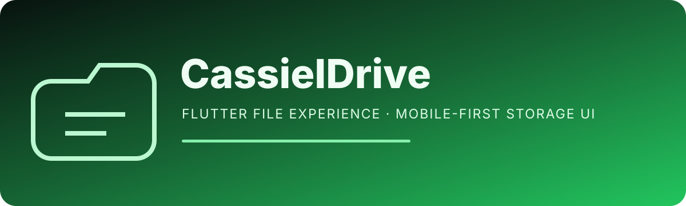
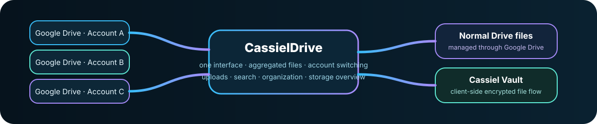

<p align="center"></p>

# CassielDrive

**A multi-account Google Drive client that brings files from several Drive accounts into one interface, with search, uploads, storage views and an optional client-side encrypted vault for files you want to protect before upload.**

## Why this is useful

People often end up with files spread across more than one Google account: a personal account, an old account, a college/work account, or extra accounts created for different projects. Switching browser tabs and remembering where each file lives becomes inconvenient.

CassielDrive is useful for:

- viewing files from multiple connected Google Drive accounts through one application;
- switching between accounts without treating each Drive as a completely separate experience;
- searching and organizing files from a single UI;
- tracking combined storage usage across connected accounts;
- uploading and downloading files from Android or web builds;
- optionally encrypting selected vault files on the client before they are sent to cloud storage;
- learning how OAuth, Google Drive APIs, upload orchestration and local client state can be combined in Flutter.

It does **not** create free storage by itself or bypass Google Drive quotas. Each connected account still follows Google's storage limits, API limits and account policies.

## How the storage experience works

<p align="center"></p>

```text
Connect Google account(s)
         |
         v
Load file metadata from each Drive
         |
         v
Present files in one CassielDrive interface
    |          |          |
    v          v          v
 search      upload      organize
    |
    +--------------------------+
                               |
                       optional Vault flow
                               |
                               v
                   encrypt selected file locally
                               |
                               v
                         upload ciphertext
```

## Main capabilities

| Capability | What it gives the user |
| --- | --- |
| Multi-account aggregation | Load files from all connected Drive accounts or a selected account. |
| Drive browser | Browse folders and files without opening the normal Google Drive UI. |
| Search | Filter loaded files by name from the application interface. |
| Upload queue | Queue uploads, show progress, retry failures and select a target account. |
| Storage overview | Aggregate usage information from connected accounts. |
| File actions | Download, rename, delete and create folders through the Drive integration. |
| Organization | Category/statistics utilities and an organizer service for file grouping. |
| Cassiel Vault | Client-side encryption/decryption path for selected protected files. |
| Cross-platform UI | Flutter application structure with Android and web targets in the repository. |

## Multi-account behavior

The storage provider can load files from one requested account or iterate over all authenticated accounts and combine the results in the client. Each file keeps its Drive-account identity so actions can be sent back to the correct account.

This makes CassielDrive an **aggregating client**, not a service that merges Google accounts at the provider level.

## Vault encryption

The repository includes `lib/services/encryption_service.dart`, which currently:

- derives a 256-bit AES key from the supplied password using SHA-256;
- encrypts data with AES-256-CBC and a random 16-byte IV;
- prepends the IV to the encrypted output;
- uses SHA-256 hashing for an integrity-comparison helper;
- stores a vault-password hash through `flutter_secure_storage`.

This is accurately described as **client-side vault encryption**, not as a formal audited zero-knowledge system.

### Security improvement note

For a production-grade vault, the cryptographic design should be strengthened before making high-assurance security claims. Good next steps include:

- replace direct SHA-256 password derivation with a password KDF such as Argon2id, scrypt or PBKDF2 with a unique salt and suitable work factor;
- use authenticated encryption such as AES-GCM or ChaCha20-Poly1305 so integrity/authenticity are built into encryption;
- define a versioned encrypted-file format containing KDF parameters, salt, nonce/IV and algorithm version;
- add tamper/failure tests and recovery behavior;
- document key-loss consequences clearly;
- obtain independent review before describing the vault as high-assurance security.

## Repository structure

```text
lib/
├─ core/                 constants, theme and utilities
├─ models/               accounts, files, chunks and user models
├─ providers/            auth, storage and theme state
├─ screens/
│  ├─ accounts_screen.dart
│  ├─ dashboard_screen.dart
│  ├─ login_screen.dart
│  ├─ settings_screen.dart
│  └─ vault_screen.dart
├─ services/
│  ├─ auth_service*.dart
│  ├─ drive_service.dart
│  ├─ encryption_service.dart
│  ├─ storage_orchestrator.dart
│  ├─ upload_manager.dart
│  └─ ai_organizer.dart
└─ widgets/              file, account, storage and upload UI

web/                     Flutter web/auth/setup assets
website/                 standalone promotional website
assets/                  application + README artwork
```

## Build from source

Install Flutter, clone the repository and restore packages:

```bash
git clone https://github.com/cassielxyz/CassielDrive.git
cd CassielDrive
flutter pub get
flutter analyze
flutter test
flutter run
```

Android release build:

```bash
flutter build apk --release
```

Web build:

```bash
flutter build web
```

## Google Drive authentication

CassielDrive uses Google OAuth/Drive API integration. Use your own correctly configured Google Cloud project and OAuth client where required by the current build.

Keep OAuth client secrets, refresh tokens and account/session material out of Git. Browser builds have different OAuth security constraints than installed applications, so configure each platform using Google's supported OAuth flow rather than copying secrets into public frontend code.

## Security and privacy notes

- Google Drive remains the underlying storage provider for normal files.
- Connecting multiple accounts does not combine or bypass their provider quotas.
- OAuth tokens and refresh/session material should be treated as secrets.
- Client-side vault encryption protects only the files actually passed through that vault flow.
- Do not call the current vault "military-grade" or "zero knowledge" without a formal design/audit supporting those terms.
- Treat cloud filenames and metadata as untrusted input.
- Validate external URLs and downloaded files before opening them.
- Remove build/debug artifacts and sensitive local state before publishing releases.

## Product directions

Useful future work includes stronger vault cryptography, conflict-safe multi-account search, explicit per-file account labels, background sync, duplicate detection, upload-session persistence, account health indicators, quota-aware target selection, encrypted backup/restore of local settings, and integration tests against Google Drive test accounts.

## Topics and tags

`google-drive` · `cloud-storage` · `multi-account` · `file-manager` · `flutter` · `dart` · `google-drive-api` · `oauth2` · `file-upload` · `encrypted-vault` · `android` · `flutter-web` · `personal-cloud`

## Suggested GitHub About description

> Multi-account Google Drive client for browsing, searching and uploading files from one Flutter interface, with an optional client-side encrypted vault for selected files.

<p align="center"><sub>One interface for files spread across several Google Drive accounts.</sub></p>
